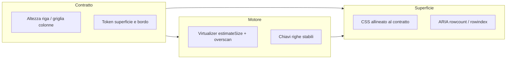

# Tabelle dati — guida completa (sviluppo, design, accessibilità)

Riferimento per **implementazione**, **visual design** e **accessibilità** delle tabelle e liste tabellari nell’app (stack: React, TypeScript, Tailwind v4, `@tanstack/react-virtual` / TanStack Table dove serve).

**Principio:** una tabella ben fatta è un **oggetto di prodotto** (contenuto + gerarchia + stati + performance), non solo markup. Questa guida unisce pratica da **sviluppatore** (semantica, ARIA, virtualizzazione, test) e da **graphic/UI designer** (ritmo, densità, contrasto, scansionabilità, coerenza col design system).

Non sostituisce gli standard W3C: in caso di dubbio, prevalgono le **fonti ufficiali** linkate.

**Ultimo aggiornamento sintesi:** 2026-03-30 (allineamento §27 al codice checklist: tabella in `SetWorkspace`, foil da stato collezione).

---

## Indice

1. [Quando usare (e non usare) una tabella](#1-quando-usare-e-non-usare-una-tabella)
2. [Compiti utente e obiettivi di design](#2-compiti-utente-e-obiettivi-di-design)
3. [Contenuto e gerarchia informativa](#3-contenuto-e-gerarchia-informativa)
4. [Tipografia](#4-tipografia)
5. [Colore, contrasto e stati](#5-colore-contrasto-e-stati)
6. [Spaziatura, densità e ritmo verticale](#6-spaziatura-densità-e-ritmo-verticale)
7. [Allineamento e colonne](#7-allineamento-e-colonne)
8. [Bordi, separatori, zebra, ombre](#8-bordi-separatori-zebra-ombre)
9. [Header: sticky, ordinamento, etichette](#9-header-sticky-ordinamento-etichette)
10. [Righe: hover, selezione, attivazione, disabilitazione](#10-righe-hover-selezione-attivazione-disabilitazione)
11. [Struttura HTML e WCAG (tabelle “vere”)](#11-struttura-html-e-wcag-tabelle-vere)
12. [Tabelle complesse: `scope`, `id` / `headers`](#12-tabelle-complesse-scope-id--headers)
13. [ARIA: `table` vs `grid`, ruoli e proprietà](#13-aria-table-vs-grid-ruoli-e-proprietà)
14. [Ordinamento accessibile (`aria-sort`, pulsanti header)](#14-ordinamento-accessibile-aria-sort-pulsanti-header)
15. [Virtualizzazione, scroll e integrità ARIA](#15-virtualizzazione-scroll-e-integrità-aria)
16. [TanStack: Table + Virtual (responsabilità separate)](#16-tanstack-table--virtual-responsabilità-separate)
17. [Tastiera, focus, selezione righe](#17-tastiera-focus-selezione-righe)
18. [Layout CSS: sticky, `border-collapse`, prime colonne fisse](#18-layout-css-sticky-border-collapse-prime-colonne-fisse)
19. [Responsive e viewport stretti](#19-responsive-e-viewport-stretti)
20. [Riflusso, spaziatura utente (WCAG 1.4.12) e altezze fisse](#20-riflusso-spaziatura-utente-wcag-1412-e-altezze-fisse)
21. [Stati di interfaccia: caricamento, vuoto, errore](#21-stati-di-interfaccia-caricamento-vuoto-errore)
22. [Movimento ridotto e micro-interazioni](#22-movimento-ridotto-e-micro-interazioni)
23. [Internazionalizzazione e RTL](#23-internazionalizzazione-e-rtl)
24. [Test e strumenti](#24-test-e-strumenti)
25. [Anti-pattern comuni](#25-anti-pattern-comuni)
26. [Checklist pre-merge (estesa)](#26-checklist-pre-merge-estesa)
27. [Rapporto con il codice in questo repository](#27-rapporto-con-il-codice-in-questo-repository)
28. [Bibliografia e fonti autorevoli](#28-bibliografia-e-fonti-autorevoli)
29. [Integrazione unificata: virtualizzazione × design × UX](#29-integrazione-unificata-virtualizzazione--design--ux-pipeline-senza-sganci)
30. [Codice: implementazione ad alta precisione](#30-codice-implementazione-ad-alta-precisione)
31. [Storico](#31-storico)

---

## 1. Quando usare (e non usare) una tabella

### Quando ha senso

- Dati **relazionali** tra righe e colonne: confronto lungo una dimensione (es. stesso attributo in colonna).
- **Scansione verticale** ripetuta (numero collezione, prezzo, stato).
- **Azioni per riga** ripetute (checkbox, menu contestuale, “apri dettaglio”).
- Necessità di **allineamento** tra valori (numeri, date) su più righe.

### Quando evitare o semplificare

- Contenuto **dominato da immagine** e pochi metadati: **griglia**, card, lista a blocchi.
- Dataset piccoli e **narrativi**: definizioni, FAQ, testo correrebbe meglio fuori tabella.
- **Layout di pagina**: non usare `<table>` per impaginare (anti-pattern a11y e manutenzione).

### Decisione rapida

| Esigenza | Preferenza tipica |
|----------|-------------------|
| Confronto multi-attributo su molte entità | Tabella o lista tabellare |
| Primato visivo dell’illustrazione | Griglia / galleria |
| Una colonna “principale” e il resto accessorio | Valutare lista con meta righe |

Fonte compiti utente: [NN/g — Data Tables: Four Major User Tasks](https://www.nngroup.com/articles/data-tables).

---

## 2. Compiti utente e obiettivi di design

Quattro macro-compiti (NN/g), che la UI deve supportare **senza** far dipendere tutto dalla memoria di lavoro:

1. **Trovare** record che soddisfano criteri (filtri, ordinamento, ricerca, scansione).
2. **Confrontare** valori allineati in colonna.
3. **Vedere / modificare** una singola riga (dettaglio, form inline se previsto).
4. **Agire** su record (azioni bulk, export, eliminazione, ecc.).

Implicazioni di design:

- **Ordine righe** prevedibile (es. data decrescente, numero crescente) e coerente col dominio.
- **Colonne il più possibile poche**: molte righe si scansionano meglio di molte colonne.
- **Header corti**; contenuto cella conciso; dove serve dettaglio, **drill-down** (riga → pannello/modale).

---

## 3. Contenuto e gerarchia informativa

- **Un concetto per cella** (GOV.UK content design): evitare paragrafi multipli o elenchi densi in una cella salvo casi forzati.
- **Truncation**: ogni volta che tagli il testo con ellissi, valuta **tooltip** o **colonna espandibile** o **dettaglio riga** — altrimenti l’utente perde informazione critica. La truncation non è “gratis” in termini di UX.
- **Formati coerenti** per tipo di dato (date, valute, unità): stesso pattern in tutta la colonna.
- **Numeri e unità**: unità ripetute in header o una sola volta in caption/legenda se chiaro, per ridurre rumore visivo.

---

## 4. Tipografia

### Scelta e ruolo

- **Corpo tabella**: preferire il font **sans** del design system per leggibilità a dimensioni piccole/medie.
- **Dati numerici / codici**: **monospace** o cifre tabular su font proporzionale — coerente con [07-typography-stack.md](./07-typography-stack.md) (es. JetBrains Mono per colonne “codice” o numeri densi).

### Cifre tabulari e allineamento ottico

- **`font-variant-numeric: tabular-nums`** (Tailwind: `tabular-nums`): larghezze cifre uniformi → colonne numeriche allineate in lettura. Utile per importi, quantità, N° collezione.
- **`lining-nums`** vs cifre “oldstyle”: in contesti dati, spesso preferibili **lining** per coerenza verticale; dipende dal font (OpenType).
- **Fallback**: `font-feature-settings: "tnum"` se serve compatibilità storica; verificare che il font scelto esponga le feature ([MDN — font-variant-numeric](https://developer.mozilla.org/en-US/docs/Web/CSS/font-variant-numeric)).

### Dimensione e line-height

- Non ridurre il testo sotto la soglia leggibile solo per “fit” — meglio **scroll orizzontale** controllato, **wrapping** o **riduzione colonne**.
- Line-height sufficiente per **WCAG 1.4.12** (vedi §20): evitare `line-clamp` / altezze fisse su celle che devono accogliere testo utente ridimensionato.

---

## 5. Colore, contrasto e stati

- **Testo / sfondo**: rispettare contrasto minimo (AA: 4.5:1 per testo normale, 3:1 per testo grande — riferimento [Understanding SC 1.4.3](https://www.w3.org/WAI/WCAG22/Understanding/contrast-minimum.html) e linee guida tema in [04-accessibility-theme.md](./04-accessibility-theme.md)).
- **Solo colore**: non usare il colore come unica codifica di stato (OK/KO). Aggiungere **testo**, **icona** o **pattern** — [Understanding SC 1.4.1 Use of Color](https://www.w3.org/WAI/WCAG22/Understanding/use-of-color.html).
- **Stati riga** (hover, selezione, errore): differenze percettibili anche in **modalità monocromatica** (luminosità + bordo + icona).
- **Header**: sfondo distinto dal corpo; attenzione al contrasto del testo su header “accent”.

---

## 6. Spaziatura, densità e ritmo verticale

- **Padding celle**: coerenza orizzontale tra colonne; evitare che una colonna “respiri” e un’altra sia compressa senza motivo.
- **Densità** (ispirazione Material “density scale”): ridurre padding verticale per tabelle **strumento** (molte righe, utenti esperti); mantenere più aria per tabelle **lettura** o onboarding. Non abbassare la densità a scapito di **target touch** minimi su touchpad/touch (vedi [Understanding SC 2.5.8 Target Size](https://www.w3.org/WAI/WCAG22/Understanding/target-size-minimum.html) — Minimum AA).
- **Altezza riga**: deve **includere** padding, bordo, contenuto (miniature, badge). Per virtualizzazione, l’`estimateSize` deve combaciare col CSS reale.

---

## 7. Allineamento e colonne

- **Testo (LTR)**: in genere **sinistra**; header allineato come i dati.
- **Numeri** (confronto di grandezza): **destra** + tabular-nums.
- **Azioni** (icon buttons): spesso **destra** in colonna dedicata o centro se poche.
- **Larghezze**: `minmax`, `%`, `fr` in CSS grid, o larghezze tabella con `table-layout: auto` vs `fixed` — trade-off tra ellipsis stabili e adattamento contenuto.

Riferimenti utili: [Cone Trees — Cell alignment](https://www.conetrees.com/articles/data-tables-cell-content-alignment-usability-guidelines/), [Matt Ström — Design better data tables](https://mattstromawn.com/writing/tables/).

---

## 8. Bordi, separatori, zebra, ombre

- **Separatori orizzontali** sottili (`border-b`) spesso battono una **griglia completa** (meno rumore visivo).
- **Zebra**: alternanza leggerissima di sfondo — pochi punti percentuali di differenza luminanza; attenzione: con **virtualizzazione**, la zebra deve basarsi sull’**indice nel dataset**, non su `:nth-child` del DOM parziale.
- **Header sticky**: bordo inferiore + **sfondo quasi opaco** per evitare “testo che scorre sotto” ([CSS-Tricks — sticky header](https://css-tricks.com/a-table-with-both-a-sticky-header-and-a-sticky-first-column/)).
- **Ombre**: micro-ombra sotto header sticky per separazione profondità; non esagerare (dark UI).

---

## 9. Header: sticky, ordinamento, etichette

- **Sticky**: contenitore scrollabile (`overflow: auto`); header con `position: sticky; top: 0`; `z-index` coerente; **background** non trasparente.
- **Ordinamento**: header interattivo spesso implementato come **`<button>`** dentro `th` (pattern [APG — Sortable Table Example](https://www.w3.org/WAI/ARIA/apg/patterns/table/examples/sortable-table/)) — vedi §14.
- **Etichette**: nomi colonna **univoci** e descrittivi; evitare abbreviazioni opache senza glossario.

---

## 10. Righe: hover, selezione, attivazione, disabilitazione

- **Hover**: feedback leggero (sfondo); non l’unico indice di selezione.
- **Selezione**: stile distinto da hover; per molte righe selezionate, considerare **conteggio** e “select all” in header.
- **Click riga** vs **controlli**: se la riga è cliccabile, **non** rubare focus a checkbox/link — eventi che ignorano target dentro `input`, `label`, `button`, `a` (pattern già usato in codebase storica).
- **Righe disabilitate**: opacità + `pointer-events` / `aria-disabled` coerenti; non dipendere solo dal grigio.

---

## 11. Struttura HTML e WCAG (tabelle “vere”)

Quando il DOM contiene **tutte** le righe (niente virtualizzazione), preferire HTML semantico:

| Elemento | Ruolo |
|----------|--------|
| `<table>` | Contenitore |
| `<caption>` | Titolo/tema della tabella (primo figlio consigliato) |
| `<thead>` / `<tbody>` / `<tfoot>` | Sezioni |
| `<th>` | Intestazioni |
| `<td>` | Celle dati |

**Tecniche WCAG 2.2:**

- [H51 — Markup tabellare per informazione tabellare](https://www.w3.org/WAI/WCAG22/Techniques/html/H51)
- [H39 — Caption associata alla tabella](https://www.w3.org/WAI/WCAG22/Techniques/html/H39)
- [H63 — `scope` su `th`](https://www.w3.org/WAI/WCAG22/Techniques/html/H63)

Panoramica: [WebAIM — Accessible Data Tables](https://webaim.org/techniques/tables/data/), [WAI — Tables Tutorial](https://www.w3.org/WAI/tutorials/tables/).

---

## 12. Tabelle complesse: `scope`, `id` / `headers`

- **`scope="col"` | `"row"` | `"colgroup"` | `"rowgroup"`**: associazione header-celle per tabelle non banali ([H63](https://www.w3.org/WAI/WCAG22/Techniques/html/H63)).
- **`id` su `th` + `headers` su `td`**: quando una cella dipende da **più** header non risolvibili con `scope` da soli ([H43](https://www.w3.org/WAI/WCAG22/Techniques/html/H43)).
- **Multi-level headers**: guida WAI con esempi — [Tables with Multi-Level Headers](https://www.w3.org/WAI/tutorials/tables/multi-level/); valutare se **spezzare** in tabelle più semplici (raccomandazione WAI per ridurre complessità cognitiva).

---

## 13. ARIA: `table` vs `grid`, ruoli e proprietà

- **`role="table"`** (o `<table>`): struttura dati; widget interattivi nelle celle restano **tab stop** separati ([APG — Table Pattern](https://www.w3.org/WAI/ARIA/apg/patterns/table/) — per la tabella “statica”, interazione tastiera complessa non è il focus del pattern base).
- **`role="grid"`**: widget composito stile foglio (frecce, editing cella, selezione avanzata) — [APG Grid Pattern](https://www.w3.org/WAI/ARIA/apg/patterns/grid/); costo implementativo alto (tastiera, focus, annunci).
- **Proprietà**: [Grid and Table Properties](https://www.w3.org/WAI/ARIA/apg/practices/grid-and-table-properties/) — `aria-rowcount`, `aria-rowindex`, `aria-colcount`, `aria-colindex` quando il DOM non rappresenta l’intero dataset.

Per checklist “leggi + checkbox + dettaglio”, spesso basta **table** + controlli nativi, **senza** grid, salvo requisiti espliciti di navigazione stile spreadsheet.

---

## 14. Ordinamento accessibile (`aria-sort`, pulsanti header)

- Su **`th`** (o elemento con `role="columnheader"`): **`aria-sort`** con valori `ascending` | `descending` | `none` | `other` — solo sulla colonna attualmente ordinata ([MDN — aria-sort](https://developer.mozilla.org/en-US/docs/Web/Accessibility/ARIA/Reference/Attributes/aria-sort)).
- Spostare `aria-sort` quando cambia colonna ordinata; aggiornare **etichetta visiva** (freccia) e non solo il colore.
- Esempio ufficiale: [APG — Sortable Table Example](https://www.w3.org/WAI/ARIA/apg/patterns/table/examples/sortable-table/).

---

## 15. Virtualizzazione, scroll e integrità ARIA

Con **TanStack Virtual** / react-window:

- Le righe fuori viewport **non sono nel DOM**: gli screen reader non le “vedono” senza metadati.
- Usare **`aria-rowcount`** (totale righe dati + eventuale riga header secondo il modello scelto) e **`aria-rowindex`** sulle righe montate (indice **1-based** nel dataset completo), come da [Grid and Table Properties](https://www.w3.org/WAI/ARIA/apg/practices/grid-and-table-properties/).
- **Inconsistenze** tra indici annunciati e dati reali = fallimento di UX per utenti SR — test obbligatorio.

**Layout:**

- `transform: translateY` su `<tr>` può interagire male con sticky/bordi ([TanStack/virtual #585](https://github.com/TanStack/virtual/issues/585)).
- Alternative: **div + CSS grid** + ruoli ARIA, **oppure** strategie “spacer” / tabelle che non rompono il layout nativo.

**Overscan:** tarare `overscan` per dispositivo; bilanciare DOM vs scroll veloce.

---

## 16. TanStack: Table + Virtual (responsabilità separate)

- **TanStack Table**: modello colonne, sorting, filtering, stato di selezione — [Virtualization guide](https://tanstack.com/table/latest/docs/guide/virtualization).
- **TanStack Virtual**: quali righe montare nel DOM — [TanStack Virtual docs](https://tanstack.com/virtual/latest).
- **Selezione righe**: API documentata ([Row Selection](https://tanstack.com/table/latest/docs/guide/row-selection)); l’accessibilità (ordine tab, annunci) va **verificata** nel proprio integrazione — discussioni community su WCAG/keyboard ([es. discussion GitHub](https://github.com/TanStack/table/discussions/5533)).

---

## 17. Tastiera, focus, selezione righe

- **Non** aggiungere `tabindex="0"` su migliaia di righe: ordine tab ingestibile.
- **Tab** tra controlli focalizzabili (checkbox, link, bottoni); click riga come **aggiunta** per utenti puntatore.
- **Focus ring** visibile: mai `outline: none` senza sostituto conforme ([04-accessibility-theme.md](./04-accessibility-theme.md), [05-desktop-windows.md](./05-desktop-windows.md)).
- Se servisse navigazione frecce su **ogni** cella, si va verso **grid pattern** + modello tastiera dedicato ([APG — Developing a Keyboard Interface](https://www.w3.org/WAI/ARIA/apg/practices/keyboard-interface/)).

---

## 18. Layout CSS: sticky, `border-collapse`, prime colonne fisse

- **`border-separate` + `border-spacing-0`**: pattern citato in articoli TanStack + Tailwind per sticky puliti ([articolo DEV — TanStack Table + Tailwind](https://dev.to/morewings/lets-create-data-table-with-react-tanstack-table-and-tailwind-css-part-1-intro-and-html-layout-1dkm)).
- **Prima colonna sticky** orizzontale: attenzione a ombra/bordo di separazione — [CSS-Tricks](https://css-tricks.com/a-table-with-both-a-sticky-header-and-a-sticky-first-column/).
- Tailwind: [border-collapse](https://tailwindcss.com/docs/border-collapse).

---

## 19. Responsive e viewport stretti

Tre famiglie di strategie (spesso combinate):

1. **Scroll orizzontale** nel contenitore (`overflow-x: auto`), tabella con `min-width` — mantiene semantica e confronto tra colonne. Etichettare il blocco scrollabile (`role="region"`, `aria-labelledby` dove utile) — vedi [CSS-Tricks — Under-Engineered Responsive Tables](https://css-tricks.com/under-engineered-responsive-tables/).
2. **Priorità colonne**: nascondere colonne meno critiche sotto breakpoint (solo se i dati restano recuperabili altrove).
3. **Card stack / pattern righe**: ripiegare righe in card con etichette ripetute — attenzione a non **distruggere** la semantica tabella per SR; pattern e rischi discussi in [WAI — responsive tables (draft/mobile)](https://w3c.github.io/wai-mobile-intro/mobile/responsive-tables/) e guide accessibili ([es. panoramica Digital Thrive](https://digitalthriveai.com/en-us/resources/frontend-development/accessible-front-end-patterns-responsive-tables-part1/)).

**Regola:** scegli il pattern in base al **compito** (confronto forzato → scroll; elenco indipendente → card).

---

## 20. Riflusso, spaziatura utente (WCAG 1.4.12) e altezze fisse

[Understanding 1.4.12 Text Spacing](https://www.w3.org/WAI/WCAG22/Understanding/text-spacing.html): con spaziatura aumentata dall’utente, il contenuto non deve essere **taglizzo** o inaccessibile.

Implicazioni per le tabelle:

- Evitare **altezze fisse** sulle celle di testo e `overflow: hidden` aggressivo.
- `line-clamp` su contenuto critico è rischioso per 1.4.12 — valutare espansione o dettaglio.

---

## 21. Stati di interfaccia: caricamento, vuoto, errore

- **Caricamento**: skeleton **tabellare** (righe e colonne allineate) meglio di spinner generico che fa “saltare” il layout.
- **Vuoto**: messaggio chiaro + eventuale azione (es. “Rimuovi filtri”); distinguere “nessun dato” da “errore rete”.
- **Errore**: testo comprensibile, **retry**, stato in `aria-live` region se aggiornamento dinamico.

---

## 22. Movimento ridotto e micro-interazioni

- Rispettare **`prefers-reduced-motion`**: animazioni di riordino righe, espansione, evidenziazioni — degradare a transizioni minime o assenti (coerenza con uso di `usePrefersReducedMotion` nel codebase).

---

## 23. Internazionalizzazione e RTL

- In **RTL**, invertire logicamente padding/margin e allineamenti; verificare header sticky e scroll orizzontale.
- **Numeri e locale**: formattazione date/valute con `Intl` / librerie; non concatenare stringhe a mano.

---

## 24. Test e strumenti

- **Screen reader Windows**: **NVDA** + (se disponibile) narratore — verifica `caption`, `th`/`scope`, `aria-sort`, annunci rowcount in tabelle virtualizzate.
- **Contrasto**: strumenti browser / plugin.
- **Tastiera**: Tab/Shift+Tab, attivazione bottoni header, checkbox righe.
- **Zoom browser** 200%: layout ancora usabile ([Reflow — 1.4.10](https://www.w3.org/WAI/WCAG22/Understanding/reflow.html) dove applicabile).

---

## 25. Anti-pattern comuni

| Anti-pattern | Perché è un problema |
|--------------|----------------------|
| `<table>` per layout pagina | Rompe semantica, SR, manutenzione |
| Solo colore per stato | Fallisce 1.4.1, utenti con acromatopsia |
| Zebra con `:nth-child` su DOM virtualizzato | Pattern visivo sbagliato |
| `aria-rowindex` incoerente col dataset | Annunci SR falsi |
| Header sticky trasparenti | Testo che si sovrappone in scroll |
| Colonne infinite su mobile senza strategia | Scroll 2D frustrante |
| Line-clamp ovunque | Rischio 1.4.12 e perdita informazioni |
| Skeleton / placeholder con geometria diversa dalla tabella finale | CLS, sensazione “due UI” |
| `overscan: 0` con layout annidati o complessi | Salti o vuoti (vedi §29) |
| Scrollbar nascosta senza alternativa equivalente | Utenti perdono affordance scroll |
| `onClick` sulla `<td>` / `role="cell"` per azioni | Lint a11y; usare `<button>` dentro cella o `role="grid"` completo |
| `React.memo` sulla riga senza capire dipendenze da stato tabella | Righe “morte” o re-render inutili ([discussion TanStack](https://github.com/TanStack/virtual/discussions/535)) |
| `accessorKey` / chiavi colonna non type-safe | Errori silenziosi e refactor pericolosi |

---

## 26. Checklist pre-merge (estesa)

- [ ] Scelta giustificata: tabella vs griglia vs lista.
- [ ] HTML semantico **oppure** `div`+ARIA giustificato (virtualizzazione / limitazioni layout).
- [ ] `caption` / etichetta equivalente per tabella nativa.
- [ ] Header: `th`+`scope` o `id`/`headers` per tabelle complesse.
- [ ] Ordinamento: `aria-sort` + controllo focus/label.
- [ ] Virtualizzazione: `aria-rowcount` / `aria-rowindex` coerenti; test SR.
- [ ] Tipografia: tabular-nums dove serve; allineamento numeri a destra.
- [ ] Contrasto e stati non solo-colore.
- [ ] Sticky header: sfondo, z-index, bordo.
- [ ] Focus visibile; nessun tab su ogni riga vuota.
- [ ] Target size controlli (touch / pointer).
- [ ] Responsive: strategia documentata (scroll, priorità, alternativa).
- [ ] `prefers-reduced-motion` rispettato.
- [ ] Stati loading / empty / error progettati.
- [ ] **Integrazione (§29):** contratto altezza / skeleton / overscan / scrollbar / test scroll — vedi checklist in §29.11.
- [ ] **Codice (§30):** TypeScript su colonne; widget in cella e 4.1.2; lint jsx-a11y; memo/chiavi virtualizer; test `getByRole` / a11y opzionale; paginazione vs scroll documentata; `forced-colors` verificato se pubblico.

---

## 27. Rapporto con il codice in questo repository

| Vista | File | Note |
|-------|------|------|
| Griglia carte | `VirtualizedChecklistGrid.tsx` | Altezza riga da `getChecklistGridRowHeightPx` in `checklistLayout.ts`. |
| Tabella checklist | `SetWorkspace.tsx` | Toggle **Griglia / Tabella**; stesso scroll container della griglia; markup semantico `role="table"` / `row` / `cell` / `columnheader`; colonne **Anteprima · N° · Nome · Foil · Posseduta**; larghezze e padding in `checklistLayout.ts` (`CHECKLIST_TABLE_*`). |
| Collezione | `useCollectionState.ts` | Possesso e **foil** utente per numero collezione; colonna Foil in tabella = Sì/No da stato locale (non da API Scryfall). |

**Miglioramenti futuri possibili in prodotto:** virtualizzazione righe tabella su set molto grandi; ordinamento colonne — da valutare con §15–§16.

**Allineamento progetto:** token colore/spaziatura in `@theme` / Tailwind ([02-design-system.md](./02-design-system.md)); font in [07-typography-stack.md](./07-typography-stack.md).

Questa guida resta il **vincolo di qualità** per evoluzioni della vista tabella.

Quando il codice e questa guida divergono: **o** si aggiorna il codice **o** si documenta qui la deroga con motivo (vedi [README best-practice](./README.md)).

---

## 28. Bibliografia e fonti autorevoli

### Standard e tutorial W3C / WAI

| Tema | Fonte |
|------|--------|
| WCAG 2.2 — tecniche HTML | [W3C WAI — Techniques](https://www.w3.org/WAI/WCAG22/Techniques/#html) |
| Tabelle — tutorial | [WAI — Tables](https://www.w3.org/WAI/tutorials/tables) |
| Caption & summary | [WAI — Caption & Summary](https://www.w3.org/WAI/tutorials/tables/caption-summary/) |
| Multi-level headers | [WAI — Multi-level](https://www.w3.org/WAI/tutorials/tables/multi-level/) |
| Grid and Table Properties | [APG](https://www.w3.org/WAI/ARIA/apg/practices/grid-and-table-properties/) |
| Sortable table example | [APG](https://www.w3.org/WAI/ARIA/apg/patterns/table/examples/sortable-table/) |
| Table pattern | [APG](https://www.w3.org/WAI/ARIA/apg/patterns/table/) |

### Accessibilità generale

| Tema | Fonte |
|------|--------|
| WebAIM — Data tables | [WebAIM](https://webaim.org/techniques/tables/data/) |
| MDN — `aria-sort` | [MDN](https://developer.mozilla.org/en-US/docs/Web/Accessibility/ARIA/Reference/Attributes/aria-sort) |
| MDN — `font-variant-numeric` | [MDN](https://developer.mozilla.org/en-US/docs/Web/CSS/font-variant-numeric) |

### UX e design system

| Tema | Fonte |
|------|--------|
| NN/g — Four user tasks | [NN/g](https://www.nngroup.com/articles/data-tables/) |
| NN/g — Comparison tables | [NN/g](https://www.nngroup.com/articles/comparison-tables/) |
| NN/g — Video desktop tables | [NN/g Video](https://www.nngroup.com/videos/designing-tables-desktop-apps/) |
| GOV.UK — Table component | [GOV.UK Design System](https://design-system.service.gov.uk/components/table/) |
| Material — Density (M3) | [M3 Layout density](https://m3.material.io/foundations/layout/understanding-layout/density) |

### Implementazione React / CSS

| Tema | Fonte |
|------|--------|
| TanStack Table — Virtualization | [TanStack Table](https://tanstack.com/table/latest/docs/guide/virtualization) |
| TanStack Virtual | [TanStack Virtual](https://tanstack.com/virtual/latest) |
| TanStack Virtual — issue layout | [GitHub #585](https://github.com/TanStack/virtual/issues/585) |
| CSS-Tricks — Responsive tables | [CSS-Tricks](https://css-tricks.com/under-engineered-responsive-tables/) |
| CSS-Tricks — Sticky header + col | [CSS-Tricks](https://css-tricks.com/a-table-with-both-a-sticky-header-and-a-sticky-first-column/) |
| Adobe Spectrum — virtual table a11y | [PR #4126](https://github.com/adobe/spectrum-web-components/pull/4126) |

### Allineamento celle e articoli

| Tema | Fonte |
|------|--------|
| Cone Trees — alignment | [Cone Trees](https://www.conetrees.com/articles/data-tables-cell-content-alignment-usability-guidelines/) |
| Matt Ström — Design better data tables | [Blog](https://mattstromawn.com/writing/tables/) |

### Virtualizzazione × layout × percezione

| Tema | Fonte |
|------|--------|
| Infinite scroll senza layout shift (CLS) | [web.dev — Infinite scroll pattern](https://web.dev/patterns/web-vitals-patterns/infinite-scroll) |
| Placeholder / CLS | [web.dev — Optimize CLS](https://web.dev/articles/optimize-cls) |
| Scroll anchoring (`overflow-anchor`) | [MDN — Scroll anchoring](https://developer.mozilla.org/en-US/docs/Web/CSS/CSS_scroll_anchoring/Scroll_anchoring), [`overflow-anchor`](https://developer.mozilla.org/en-US/docs/Web/CSS/Reference/Properties/overflow-anchor) |
| Scrollbar: usabilità e contrasto | [Adrian Roselli — Baseline rules for scrollbar usability](https://adrianroselli.com/2019/01/baseline-rules-for-scrollbar-usability.html) |
| Tabelle massicce + UX | [Ali Karaki — Virtualized tables 200k+ rows](https://www.alikaraki.me/blog/virtualized-tables-200k) |
| Skeleton e performance percepita | [LogRocket — Skeleton loading design](https://blog.logrocket.com/ux-design/skeleton-loading-screen-design) |
| TanStack Virtual — scroll dinamico / jump | [Issue #659](https://github.com/TanStack/virtual/issues/659), [Discussion #876 nested](https://github.com/TanStack/virtual/discussions/876) |

### TypeScript, TanStack, lint e test (§30)

| Tema | Fonte |
|------|--------|
| TanStack Table — colonne (`ColumnDef`) | [Columns guide](https://tanstack.com/table/latest/docs/guide/column-defs), [Data guide](https://tanstack.com/table/latest/docs/guide/data) |
| Row models / `getCoreRowModel` | [Row models](https://tanstack.com/table/latest/docs/guide/row-models) |
| Column pinning | [Pinning guide](https://tanstack.com/table/latest/docs/guide/column-pinning), [Esempio React sticky](https://tanstack.com/table/latest/docs/framework/react/examples/column-pinning-sticky) |
| Column sizing / resize | [Column sizing](https://tanstack.com/table/latest/docs/guide/column-sizing) |
| Righe virtualizzate (Table + Virtual) | [Esempio ufficiale](https://tanstack.com/table/latest/docs/framework/react/examples/virtualized-rows), [Medium — Mojca Rojko](https://medium.com/codex/building-a-performant-virtualized-table-with-tanstack-react-table-and-tanstack-react-virtual-f267d84fbca7) |
| Memo righe + virtualizer | [Discussion #535](https://github.com/TanStack/virtual/discussions/535) |
| WCAG 4.1.2 Name, Role, Value | [Understanding 4.1.2](https://www.w3.org/WAI/WCAG22/Understanding/name-role-value) |
| jsx-a11y — interazioni su elementi non interattivi | [`no-noninteractive-element-interactions`](https://github.com/jsx-eslint/eslint-plugin-jsx-a11y/blob/main/docs/rules/no-noninteractive-element-interactions.md) |
| Test a11y in Vitest | [@accesslint/vitest](https://www.accesslint.com/vitest/), [Salesforce sa11y](https://opensource.salesforce.com/sa11y/packages/vitest/) |
| Paginazione vs infinite scroll | [uxpatterns.dev](https://uxpatterns.dev/pattern-guide/pagination-vs-infinite-scroll), [LogRocket](https://blog.logrocket.com/ux-design/pagination-vs-infinite-scroll-ux/) |
| Struttura `<table>` (un `<thead>`) | [MDN `<thead>`](https://developer.mozilla.org/en-US/docs/Web/HTML/Element/thead), [web.dev — Tables](https://web.dev/learn/html/tables/) |
| ARIA `rowgroup`, `cell`, `columnheader` | [MDN rowgroup](https://developer.mozilla.org/en-US/docs/Web/Accessibility/ARIA/Reference/Roles/rowgroup_role), [MDN cell](https://developer.mozilla.org/en-US/docs/Web/Accessibility/ARIA/Reference/Roles/cell_role) |
| Resize colonna da tastiera (riferimento settore) | [react-data-grid PR #3357](https://github.com/adazzle/react-data-grid/pull/3357) |
| AG Grid — a11y e tastiera | [Documentazione](https://www.ag-grid.com/javascript-data-grid/accessibility/), [Keyboard](https://www.ag-grid.com/javascript-data-grid/keyboard-navigation/) |
| Windows — `forced-colors` | [MDN `forced-colors`](https://developer.mozilla.org/en-US/docs/Web/CSS/Reference/At-rules/@media/forced-colors), [Smashing Magazine](https://www.smashingmagazine.com/2022/03/windows-high-contrast-colors-mode-css-custom-properties/) |

---

## 29. Integrazione unificata: virtualizzazione × design × UX (pipeline senza “sganci”)

Questa sezione risponde a una domanda unica: **come far lavorare insieme** motore di virtualizzazione, decisioni visive (tipografia, colori, densità) e UX (scroll, attese, accessibilità) **senza** che una parte “tiri” l’altra e generi jank, salti, letture SR false o sensazione di prodotto amatoriale.

### 29.1 Principio: un solo sistema, non tre reparti

| Ripiego | Effetto tipico |
|---------|----------------|
| Design della tabella **senza** vincolo di altezza reale | `estimateSize` sbagliato → scroll che “balla”, thumb scrollbar mente |
| Virtualizzazione **senza** linguaggio visivo definito | Righe che sembrano “trovate per caso”: padding incoerenti, hover che lampeggia |
| UX copy/stati **senza** allineamento al layout | CLS quando arrivano i dati; skeleton che non coincide con la griglia |

**Regola:** prima di scrivere componenti, definite un **contratto di riga** condiviso (vedi §29.2) tra design (Figma/token), dati e virtualizer.

### 29.2 Contratto di altezza riga (il fulcro)

- **Righe a altezza fissa** (o calcolabile **deterministicamente** dalla larghezza contenitore, come in `getChecklistGridRowHeightPx`): massima **prevedibilità** per il virtualizer, minimo ricalcolo, scrollbar che riflette il dataset. È la scelta preferita per “strumenti” ad alta frequenza (checklist, log).
- **Altezza variabile** (testo multilinea, immagini senza box riservato): costo di misura, rischio **flicker** e **salti** in scroll (noto con molte lib: issue su altezze dinamiche). Se inevitabile:
  - riservare **min-height** / **aspect-ratio** uguali al contenuto finale;
  - cache delle misure dove l’API lo consente;
  - evitare loop di aggiornamento (resize → remeasure → scroll → resize).

Il design **non** può chiedere “ogni riga diversa” senza accettare il costo in complessità: o si **standardizza** la riga, o si documenta il costo e si testa su dataset reali.

### 29.3 Scroll totale, thumb e modello mentale

- L’altezza del contenitore interno (`totalSize` nel pattern TanStack) deve corrispondere alla **somma logica** delle righe (più header se incluso nel modello). Se il totale “respira”, l’utente percepisce **scroll infinito instabile** o scrollbar ingannevole.
- Il **pollice** della scrollbar è un indicatore di “dove sono nel dataset”: va bene che sia piccolo con 100k righe, ma non va bene se salta perché le altezze non combaciano.

### 29.4 Overscan: morbidezza visiva vs CPU

- `overscan` aggiunge righe fuori viewport per ridurre **vuoti** nello scroll veloce; valori troppo alti = più React work. Tarare (es. partire da pochi elementi, salire se si vede “bianco”).
- Con **virtualizer annidati** o layout complessi, `overscan: 0` può peggiorare salti; la community segnala che valori ≥ **1** aiutano in alcuni casi ([discussion TanStack Virtual](https://github.com/TanStack/virtual/discussions/876)).

### 29.5 Scroll anchoring del browser vs lista virtuale

- Il browser applica **scroll anchoring** per limitare i salti quando il contenuto sopra il viewport cambia ([MDN — Scroll anchoring](https://developer.mozilla.org/en-US/docs/Web/CSS/CSS_scroll_anchoring/Scroll_anchoring)).
- Le liste virtualizzate che **rimuovono/montano** nodi e usano `transform` possono interagire in modo non ovvio con l’anchoring. La proprietà **`overflow-anchor`** (`auto` / `none`) sul contenitore scrollabile va **considerata esplicitamente** durante il debug di “salti” non spiegati ([`overflow-anchor` MDN](https://developer.mozilla.org/en-US/docs/Web/CSS/Reference/Properties/overflow-anchor)): documentare la scelta nel componente, non per tentativi casuali.

### 29.6 Layout shift (CLS) e contenuto che arriva dopo

- Pattern web.dev: **spazio riservato** e placeholder con **stesse dimensioni** del contenuto finale ([Infinite scroll without layout shifts](https://web.dev/patterns/web-vitals-patterns/infinite-scroll), [Optimize CLS](https://web.dev/articles/optimize-cls)).
- **Immagini in cella**: `width` / `height` o **aspect-ratio** + sfondo segnaposto; altrimenti le righe già misurate “saltano” quando l’immagine carica.
- **Skeleton**: deve **riusare la stessa geometria** (colonne, altezza riga, separatori) della tabella finale — altrimenti la percezione è “due UI diverse” ([LogRocket — skeleton loading](https://blog.logrocket.com/ux-design/skeleton-loading-screen-design)).

### 29.7 Superficie visiva coerente con il motore

- **Zebra / striping**: basarsi sull’**indice nel dataset**, mai sul solo DOM visibile (già in §25).
- **Hover riga**: transizioni leggere; in `prefers-reduced-motion` ridurre o azzerare (§22).
- **Sticky header** (§9, §18): stesso **background token** del tema, **z-index** sopra le righe virtuali; niente trasparenza che mostri testo che scorre sotto.
- **Prima colonna sticky** + virtualizzazione orizzontale (se mai): stesso piano di attenzione a **ombre** e bordo di taglio — altrimenti “sgancio” visivo tra header e corpo.

### 29.8 Scrollbar: parte dell’interfaccia, non optional

- Nascondere la scrollbar (`scrollbar-width: none`, overlay aggressivi) **peggiora** usabilità e può violare aspettative di accessibilità; **contrasto** thumb/track e **area cliccabile** vanno considerati se si personalizza ([Adrian Roselli — scrollbar usability](https://adrianroselli.com/2019/01/baseline-rules-for-scrollbar-usability.html)). Preferire **`thin`** a **nascosta** dove serve compattezza ([MDN — scrollbar-width](https://developer.mozilla.org/en-US/docs/Web/CSS/scrollbar-width)).

### 29.9 React: meno re-render, più stabilità percepita

- **Memoizzare** il renderer di riga quando possibile; evitare **nuovi oggetti** inline nelle props di ogni render se causano re-render di migliaia di celle.
- **Chiave riga**: stabile e di dominio (`id`, numero collezione), non l’indice nell’array se l’ordine può cambiare (ordinamento/filtri).
- Stato **locale** alla riga (es. menu aperto) isolato per non far tremare l’intera lista.

### 29.10 CSS prestazioni (con cautela)

- In scenari con **molte colonne**, Chromium può risultare più “pesante”; segnalazioni della community citano utili **contenimento** / ottimizzazioni paint — sempre verificate su **profilo reale**, non come cargo cult ([issue performance colonne](https://github.com/TanStack/virtual/issues/860)).
- `will-change`, `contain`, layer GPU: utili ma **non** ovunque (memoria, testo sfocato in alcuni casi). Misurare.

### 29.11 Protocollo di verifica “senza sganci”

Prima di considerare la vista **pronta**:

1. **Scroll veloce** (rotella, trackpad) per secondi: niente flash bianchi ripetuti → alzare overscan o correggere altezza.
2. **Resize** finestra: righe e colonne si ricalcolano senza salti strani.
3. **Cambio filtro / ordinamento**: posizione scroll o reset **intenzionale** e comprensibile (non jump casuale).
4. **Zoom** pagina 125–200%: ancora leggibile (§20, §24).
5. **SR**: `aria-rowcount` / `aria-rowindex` allineati al dataset (§15).
6. **Immagini**: caricamento tardivo non sposta layout se il contratto di altezza è rispettato.

### 29.12 Collegamento alle altre sezioni

- Tipografia e numeri: §4. Colori e stati: §5. Densità: §6. Header e sticky: §9–§18. Virtualizzazione pura: §15–§16. Motion: §22. Questa §29 è il **collante** operativo tra tutte.

---

## 30. Codice: implementazione ad alta precisione

Questa sezione è il complemento **puramente tecnico** di §15–§16 e §29: come **scrivere** tabelle e liste tabellari in React/TypeScript senza errori sistematici (tipi, lint, widget in cella, stato, test). Le fonti sono raccolte in §28 (sottosezione “TypeScript, TanStack, lint e test”).

### 30.1 TypeScript: modello dati e colonne type-safe

- Definire **`TData`** (tipo riga) una volta; farlo fluire in **`ColumnDef<TData>`** (TanStack) — [Columns guide](https://tanstack.com/table/latest/docs/guide/column-defs), [Data guide](https://tanstack.com/table/latest/docs/guide/data).
- Preferire **`accessorKey`** con chiavi presenti su `TData`. Per campi annidati usare le forme documentate dalla lib, non `any`.
- **Formatter** (`cell`) tipizzati sul valore colonna — vedi [discussioni su colonne mappate](https://stackoverflow.com/questions/72716845/typescript-defining-table-columns-mapped-types).
- Evitare **stringhe magiche** duplicate per id colonna (`as const` dove utile).

### 30.2 TanStack Table: moduli, row model, pinning

- Importare solo i **row model** necessari — [Row models](https://tanstack.com/table/latest/docs/guide/row-models). Base: `getCoreRowModel()`.
- **Column pinning**: [Pinning guide](https://tanstack.com/table/latest/docs/guide/column-pinning), esempio [column-pinning-sticky](https://tanstack.com/table/latest/docs/framework/react/examples/column-pinning-sticky).
- **Column sizing**: [Column sizing](https://tanstack.com/table/latest/docs/guide/column-sizing). Resize **da tastiera** come requisito va progettato (es. [react-data-grid keyboard resize](https://github.com/adazzle/react-data-grid/pull/3357)).

### 30.3 TanStack Table + TanStack Virtual

- Esempio ufficiale: [virtualized-rows](https://tanstack.com/table/latest/docs/framework/react/examples/virtualized-rows). Articolo: [Mojca Rojko — Medium](https://medium.com/codex/building-a-performant-virtualized-table-with-tanstack-react-table-and-tanstack-react-virtual-f267d84fbca7).

### 30.4 Widget in cella e WCAG 4.1.2

- Nome, ruolo, valore programmatici — [Understanding 4.1.2](https://www.w3.org/WAI/WCAG22/Understanding/name-role-value). Preferire HTML nativo.
- Evitare `onClick` sulla sola `<td>` — controlli **dentro** la cella o modello `grid` completo — [`no-noninteractive-element-interactions`](https://github.com/jsx-eslint/eslint-plugin-jsx-a11y/blob/main/docs/rules/no-noninteractive-element-interactions.md).

### 30.5 React: memo, `useCallback`, chiavi

- `useCallback` per funzioni passate al virtualizer; chiave riga **stabile** (dominio), non index se l’ordine muta.
- `React.memo` sulla riga: attenzione a stato tabella (selezione) — [Discussion #535](https://github.com/TanStack/virtual/discussions/535).

### 30.6 HTML e ARIA

- Un `<thead>`; [MDN thead](https://developer.mozilla.org/en-US/docs/Web/HTML/Element/thead), [web.dev Tables](https://web.dev/learn/html/tables/). Ruoli: [rowgroup](https://developer.mozilla.org/en-US/docs/Web/Accessibility/ARIA/Reference/Roles/rowgroup_role), [cell](https://developer.mozilla.org/en-US/docs/Web/Accessibility/ARIA/Reference/Roles/cell_role).

### 30.7 Paginazione vs lista virtualizzata

- Trade-off: [uxpatterns.dev](https://uxpatterns.dev/pattern-guide/pagination-vs-infinite-scroll), [LogRocket](https://blog.logrocket.com/ux-design/pagination-vs-infinite-scroll-ux/).

### 30.8 Test

- `getByRole('row', …)` — [Testing Library](https://testing-library.com/docs/queries/byrole/). Vitest + a11y: [AccessLint](https://www.accesslint.com/vitest/), [sa11y](https://opensource.salesforce.com/sa11y/packages/vitest/).

### 30.9 `forced-colors` / Windows

- [MDN forced-colors](https://developer.mozilla.org/en-US/docs/Web/CSS/Reference/At-rules/@media/forced-colors), [Smashing — high contrast](https://www.smashingmagazine.com/2022/03/windows-high-contrast-colors-mode-css-custom-properties/).

### 30.10 Benchmark enterprise

- [AG Grid — Accessibility](https://www.ag-grid.com/javascript-data-grid/accessibility/), [Keyboard](https://www.ag-grid.com/javascript-data-grid/keyboard-navigation/).

### 30.11 Sintesi pre-merge

| Livello | Verificare |
|--------|------------|
| Tipi | `TData`, colonne tipizzate |
| Stato | Cosa invalida il virtualizer |
| A11y | 4.1.2; virtual → rowcount/rowindex |
| Lint | jsx-a11y |
| Test | Ruoli + scenario ordinato |
| OS | Alto contrasto se desktop Windows |

---

## 31. Storico

| Data | Nota |
|------|------|
| 2026-03-30 | Prima versione: checklist coding + UI/UX + a11y + virtualizzazione. |
| 2026-03-30 | Sez. 9 e nota repo: rimossa vista lista checklist dall’app; resta solo griglia virtualizzata. |
| 2026-03-30 | Sez. 9: vista **tabella** reintrodotta come `VirtualizedChecklistTable` + costanti in `checklistLayout`. |
| 2026-03-30 | Rimossa implementazione tabella; costanti `CHECKLIST_LIST_*` da `checklistLayout`. |
| 2026-03-30 | Toggle Griglia/Tabella ripristinato in `SetWorkspace`; vista tabella = placeholder. |
| 2026-03-30 | **Espansione maggiore:** indice, sezioni design (tipografia, colore, densità, stati), WCAG 1.4.12/1.4.1, responsive, bibliografia estesa; obiettivo guida “pro” unificata dev + designer. |
| 2026-03-30 | **§30 Codice:** TypeScript/TanStack (colonne, row models, pinning, sizing, virtualized rows), WCAG 4.1.2, eslint jsx-a11y, memo/chiavi, test Vitest, paginazione vs scroll, `forced-colors`, benchmark AG Grid; bibliografia §28 ampliata; anti-pattern e checklist aggiornate. |
| 2026-03-30 | Vista tabella: rimossi header a colonne, `ChecklistTableHeader.tsx` e costanti tabella in `checklistLayout`; placeholder in `SetWorkspace` — colonne da definire con il team. |
| 2026-03-30 | **§27:** tabella checklist in `SetWorkspace` (scroll condiviso, colonne e foil da stato collezione); rimossi riferimenti obsolete a placeholder / `VirtualizedChecklistTable`. |
